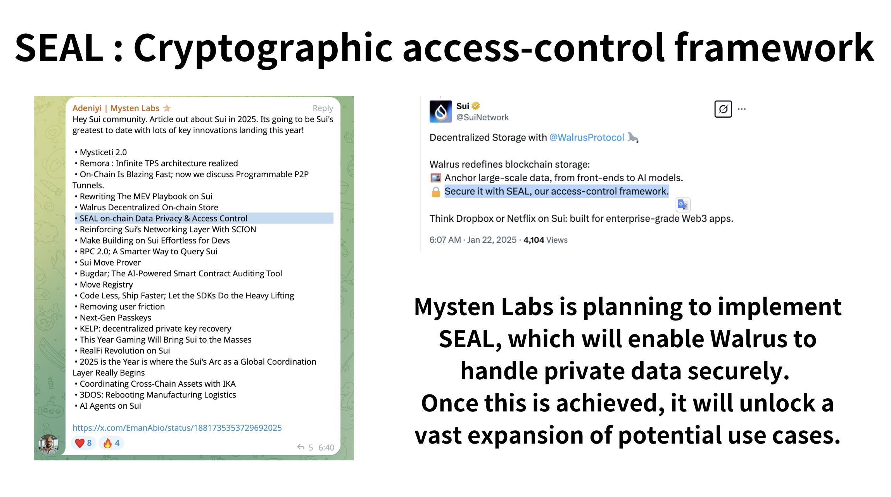

# WalrusPass

## What It Does
**WalrusPass** is a decentralized platform that enables content creators to provide exclusive content—such as music and videos—that can only be accessed by users holding a specific NFT (using NFTs as access tokens).

- **Encrypted Upload of Exclusive Content:**  

 Content such as images and videos is encrypted end-to-end before being uploaded to Walrus.

- **Decryption Accessible Only to NFT Holders:**  

 Once an NFT is minted, only its owner can use a dedicated decryption key to access the encrypted content.

- **A Trustworthy Ecosystem between Creators and Users:**  

 By linking content ownership to blockchain-based NFTs and automatically granting access rights exclusively to NFT holders, a highly reliable relationship is established.

- **Use Cases:**  

 Musicians can offer albums or live concert footage, video creators can provide exclusive clips, and online courses can feature premium videos—all designed to deliver experiences exclusively for NFT holders.

---

## The Problem It Solves

Walrus’s decentralized storage offers significant benefits such as censorship resistance and fault tolerance by eliminating reliance on centralized servers. This allows users to truly own their digital assets by storing them across a distributed network. However, decentralized storage also faces challenges in handling private data. Specifically, implementing the encryption/decryption process and strictly controlling access to data are complex tasks. This becomes particularly problematic when using NFT token gateways, where it is essential to verify NFT ownership and ensure that only NFT holders receive the decryption keys for encrypted content. Without a robust mechanism, digital assets may end up stored in centralized cloud services (like AWS), which negates the advantages of decentralized storage.

---

## The Solution – Encryption and Key Management with Tusky

Tusky provides an end-to-end data encryption solution that leverages user and Vault key management to achieve restricted access:

- **Client-Side Key Pair Generation:**  

 When logging in with Tusky, users generate their own key pair on the front end.  

 - **User Public Key:** Used for server-side processes and Vault sharing.  

 - **User Private Key:** Derived from the user’s password or backup phrase, it is used for encryption and stored on the server in an encrypted form.

- **Key Generation and Sharing during Vault Creation:**  

 When a seller (Vault owner) creates a Vault, a dedicated key pair for that Vault is generated.  

 - The Vault’s **public key** is used for encrypting content within the Vault, while its **private key** is necessary for decryption.  

 - When granting access to a buyer (NFT holder), the seller’s backend uses its stored authentication credentials to encrypt the Vault’s private key with the buyer’s user public key.  

 - This process allows the buyer to decrypt the Vault’s private key using their own user private key and obtain the decryption key needed to access the exclusive content.

- **Enhanced Security:**  

 The seller’s authentication credentials (such as API keys) are securely managed on the backend and never transmitted to the front end; they are used only when necessary. In the future, the introduction of schemes like the Seal encryption method is planned to further reinforce access control for private vaults with token restrictions.

---

### Challenges Encountered

- **Integration of On-Chain and Off-Chain Processes:**  

 Detecting NFT mint events and linking them to the automatic Vault sharing process posed significant technical challenges. Relying on the Tusky SDK sometimes led to issues where smart contract events did not correctly trigger the off-chain access control procedures.

- **Managing Authentication Credentials:**  

 Finding a secure method to manage seller authentication credentials (e.g., API keys) on the backend was challenging. While the demo automated Vault sharing by storing these credentials on the backend, this approach could compromise complete decentralization. There is a need to explore more decentralized authentication methods (such as utilizing Lit Protocol or upgrading the Seal encryption scheme).

---

## Technologies Used

- **Sui Move:**  

 - NFT minting, ownership management, and event triggering  

 - Implementation of smart contracts in Sui Move

- **Walrus:**  

 - Decentralized storage network  

 - Storage of encrypted content

- **Tusky SDK / API:**  

 - User authentication, Vault management, file uploads/downloads  

 - Vault sharing functionality

- **Next.js:**  

 - Front-end development  

 - Backend (API routes)

- **Supabase:**  

 - Database management

---

## How It Was Built

1. **Smart Contract Implementation:**  

  - Developed NFT minting smart contracts using Sui Move, triggering events (e.g., “Minted”) upon minting.

2. **Client-Side Key Management:**  

  - Integrated the Tusky SDK, allowing users to generate their own key pairs during login.  

  - The user’s private key is encrypted using a key derived from their password and stored in encrypted form on the server.  

  - When creating a Vault, the seller generates a new Vault key pair and encrypts the Vault’s private key with the buyer’s user public key.

3. **Frontend Integration:**  

  - Developed a user interface using React and Next.js that enables users to easily upload content, manage their Vaults, and access exclusive content.

---

## What We Learned

- **The Importance of On-Chain and Off-Chain Integration:**  

 Synchronizing NFT mint events with off-chain automatic access control processes proved to be challenging in both implementation and operation.

- **Decentralized Authentication and Key Management:**  

 The project underscored both the importance and the challenges of allowing users to manage their own data encryption and access control through key management.

- **The Potential of Decentralized Storage:**  

 Utilizing the Walrus and Tusky APIs demonstrated that a new paradigm of digital asset management—free from centralized service dependency—is achievable.

---

## What’s Next

- **Enhancing Smart Contract Integration:**  

 Improve the accuracy of NFT mint event detection and build a more secure off-chain relay service.

- **Exploring Decentralized IDs (DID) and Delegated Signatures:**  

 Consider decentralized methods for managing seller authentication credentials without storing them directly on the backend.

- **Expanding to New Use Cases:**  

 - **Decentralized YouTube for Exclusive Content:** Storing exclusive content on decentralized storage.  

 - **Decentralized Supply Chain Management:** Real-time sharing of product movement records and quality inspection data.  

 - **Decentralized Medical Data Sharing:** Secure storage and sharing of patient data to enhance diagnostic and treatment quality.  

 - **Media Subscription Models:** Allow creators to provide decryption keys for exclusive content to paying users.

 Additionally, Mysten Labs plans to introduce the Seal encryption scheme soon, which will offer token-restricted access to private vaults and further strengthen exclusive access control for NFT holders.

Below is an explanation of how this project meets each of the evaluation criteria:

---

## Judging Criteria

**Technicality:**  
This project leverages cutting-edge decentralized technologies. It uses Sui Move to mint NFTs and manage on-chain ownership, enabling secure content access based on blockchain events. On the client side, the Tusky SDK handles key generation and encryption, ensuring that content remains protected at all times. By combining decentralized storage (Walrus) with advanced encryption mechanisms, the project showcases use cases that are only possible through this kind of architecture.

**Originality:**  
Using NFTs as access credentials is a highly original concept. By linking blockchain-based digital ownership with secure distribution of exclusive content, the project creates a new ecosystem that goes beyond traditional subscription models. It also provides a viable alternative to conventional private data delivery systems, which often rely on centralized storage—a structure this project seeks to replace.

**Practicality:**  
This solution addresses a real-world need: allowing creators to securely deliver premium content to targeted audiences. By ensuring that only NFT holders can decrypt the content, it guarantees authenticity and exclusive ownership. This mechanism can be applied to a wide range of practical use cases. The decentralized architecture also provides fault tolerance and censorship resistance, making the solution highly usable in real deployment scenarios.

**Usability (UI/UX/DX):**  
Thanks to the Tusky SDK, users don’t have to worry about managing encryption keys themselves. The system is designed to handle key management behind the scenes, creating a smooth and intuitive user experience for both creators and consumers.

**WOW Factor:**  
This project is a powerful blend of decentralized storage, blockchain, and modern encryption. It fundamentally reimagines how digital content can be distributed and monetized—offering a new paradigm that challenges the norms of centralized content platforms.

---
